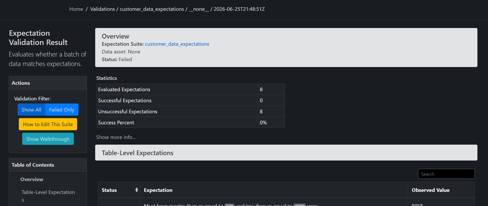
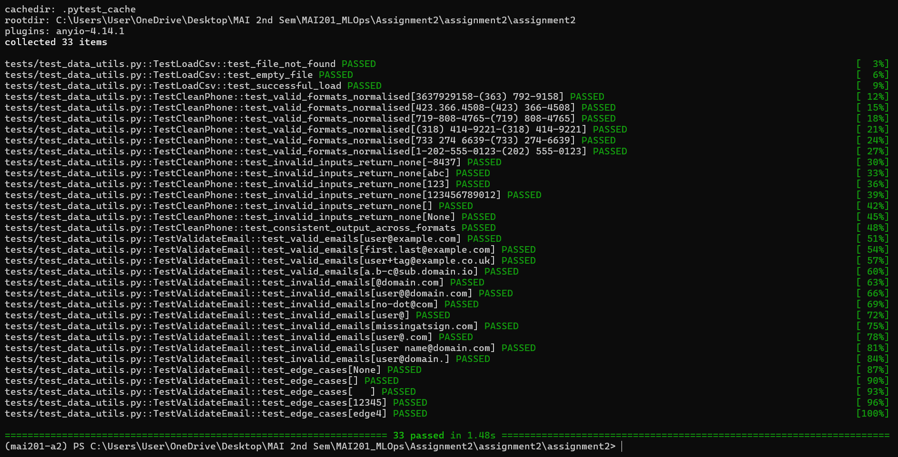

# MAI201 MLOps : Assignment 2 Report
## Data Validation & Testing

Student: Ryan Caezar Soria
Dataset: `customer_data.csv` (5,015 rows, 7 columns)
Tools: Great Expectations 0.18.19, pytest 9.x, pandas

---

## Part 1: Great Expectations Setup
A Great Expectations project was created in the gx/ folder. A data source called customer_data_source was set up to read files from the data/ folder, and the CSV file customer_data.csv was added as a data asset named customer_data_asset. An expectation suite called customer_data_expectations was also created to store the data validation rules.

All these steps are done automatically by the run_gx_validation.py script, instead of running great_expectations init and setting everything up manually.

---

## Part 2: Expectations Created 

All eight required expectations were implemented in the
`customer_data_expectations` suite:

| # | Column | Expectation | Rule |
|---|--------|-------------|------|
| 1 | `customer_id` | `expect_column_values_to_be_unique` | must be unique |
| 2 | `customer_id` | `expect_column_values_to_not_be_null` | must not be null |
| 3 | `age` | `expect_column_values_to_be_between` | between 0 and 120 |
| 4 | `email` | `expect_column_values_to_match_regex` | valid email format |
| 5 | `salary` | `expect_column_values_to_not_be_null` (`mostly=0.95`) | present in ≥ 95% of rows |
| 6 | `country` | `expect_column_values_to_be_in_set` | one of USA, Canada, UK, Australia |
| 7 | `signup_date` | `expect_column_values_to_match_strftime_format` | parseable as `%Y-%m-%d` |
| 8 | *(table)* | `expect_table_row_count_to_be_between` | between 500 and 1000 |

>Note on email validation: The email addresses are checked using the pattern
^[A-Za-z0-9._%+-]+@[A-Za-z0-9.-]+\.[A-Za-z]{2,}$, which ensures that each value follows a standard email format.

Note on signup_date: Although the schema expects a datetime value, CSV files store all data as text. Therefore, each signup_date value is checked to make sure it can be converted into a valid date in the YYYY-MM-DD format. This validation rejects invalid dates such as 2023-02-30 and 2023-13-01.

---

## Part 3: Data Quality Report

The suite was executed against the messy dataset via a checkpoint, and the
HTML data documentation was generated (saved under `data_docs/index.html`).

### Validation results

**All 8 expectations failed, 0% success,  which is the expected outcome for
this deliberately messy dataset.**

### All data quality issues found (with counts)

| # | Issue | Column(s) | Count | Detected by |
|---|-------|-----------|-------|-------------|
| 1 | Missing `customer_id` | customer_id | **150** | not-null expectation |
| 2 | Non-unique `customer_id` | customer_id | **568** rows (265 IDs repeat) | unique expectation |
| 3 | Missing `age` | age | **147** | pandas profiling |
| 4 | `age` out of range (0–120) | age | **384** (199 negative, 185 > 120) | between expectation |
| 5 | Missing `email` | email | **438** | pandas profiling |
| 6 | Invalid `email` format | email | **346** | regex expectation |
| 7 | Missing `salary` | salary | **425** (only 91.53% present, below 95%) | mostly not-null expectation |
| 8 | Negative `salary` | salary | **159** | pandas profiling |
| 9 | Missing `country` | country | **41** | pandas profiling |
| 10 | `country` not in allowed set | country | **301** non-null (342 incl. nulls) | in-set expectation |
| 11 | Missing `phone` | phone | **319** | pandas profiling |
| 12 | Inconsistent `phone` formats | phone | many formats: `3637929158`, `423.366.4508`, `719-808-4765`, `(318) 414-9221`, `733 274 6639`, plus invalid junk like `-8437` | `clean_phone` utility |
| 13 | Missing `signup_date` | signup_date | **14** | pandas profiling |
| 14 | Invalid / impossible `signup_date` | signup_date | **242** (e.g. `2023-02-30`, `2023-13-01`, `not-a-date`) | strftime expectation |
| 15 | Fully duplicated rows | all columns | **15** | pandas profiling |
| 16 | Table row count out of range | *(table)* | **5,015** rows (expected 500–1000) | row-count expectation |

Why some Great Expectations counts are lower than the raw counts: Great Expectations does not treat missing values (null) as errors for checks such as regex matching, allowed values, numeric ranges, or date formats. Instead, missing values are handled separately by not-null checks. For example, there are 342 invalid country values in total, but only 301 are non-null invalid values reported by the in-set check, while the remaining 41 are missing values reported by the not-null check.

Difference from the assignment description: The assignment mentions that the salary column contains strings with dollar signs, but in the provided dataset the salary values are already stored as numbers and do not contain $ symbols. All other data quality issues described in the assignment are present.

---

## Part 4: Pytest Unit Tests

Unit tests were written for the three data utility functions in `src/data_utils.py`:

- **`load_csv(filepath)`** — tests for file-not-found (raises `FileNotFoundError`),
  empty file (raises `ValueError`), and successful loading (returns a DataFrame of
  the correct shape).
- **`clean_phone(phone)`** — tests that six different valid formats all normalise to
  `(XXX) XXX-XXXX`, and that invalid/missing inputs (`-8437`, `abc`, `""`, `None`,
  etc.) return `None`.
- **`validate_email(email)`** — tests valid emails, eight kinds of invalid emails,
  and edge cases (`None`, empty/whitespace strings, non-string types).

**All 33 tests pass:**

---

## Part 5: Reflection- Which issue most impacts ML model performance?

The most serious issue in the dataset is the 568 duplicate customer_id values (including 15 completely duplicated rows) because they can cause data leakage.

If the same customer appears in both the training and testing datasets, the model is evaluated on data it has already seen. This can make accuracy, precision, recall, and AUC scores look much better than they really are. As a result, the model may seem to perform well during testing but fail when used on new customers in production.

Another important issue is the 384 invalid age values (such as -999 and 999) and 159 negative salary values. These unrealistic numbers can distort feature scaling, affect distance-based algorithms, and make model training less stable.

Missing values are generally less harmful because they can be handled easily by removing rows or filling in the missing values. Duplicate records are more dangerous because they make the evaluation results unreliable. Detecting these problems early with Great Expectations helps prevent poorly performing models from being deployed.
